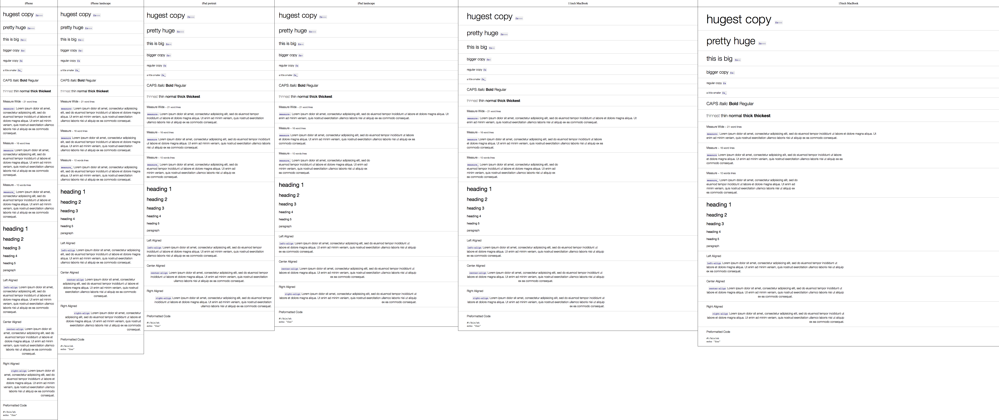

Defines a pleasant default appearance for body text, headings, pargraphs, lists,
etc. These values are repsonsive so huge text is never shown on a tiny screen
and vice versa.

Also includes a number of classes to control the appearance of the type in every
element.

Heavily inspired by the [type module in BASSCSS][1]

Here's what the `test-all-screen-widths.html` document looks like rendered with
webkit:

[1]:https://github.com/jxnblk/basscss/blob/master/scss/_type.scss
